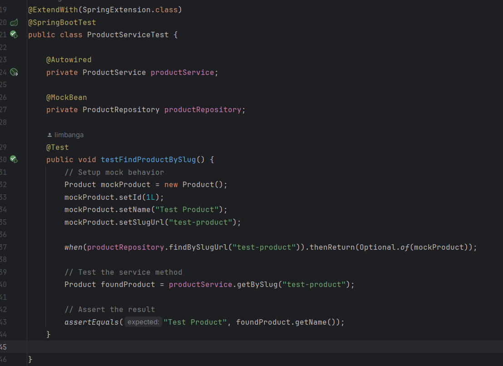
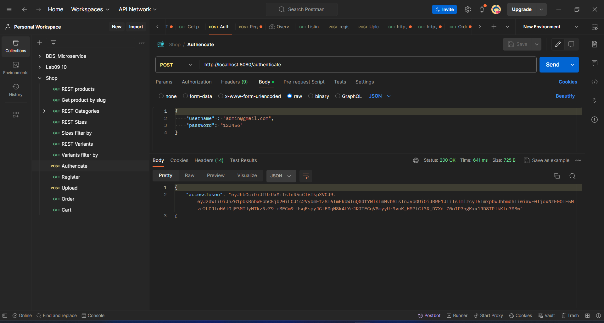
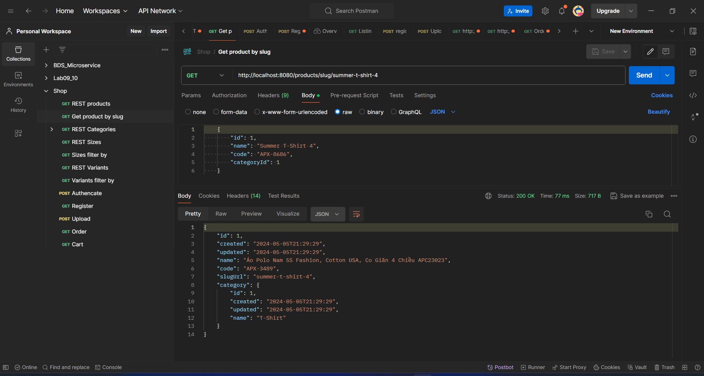
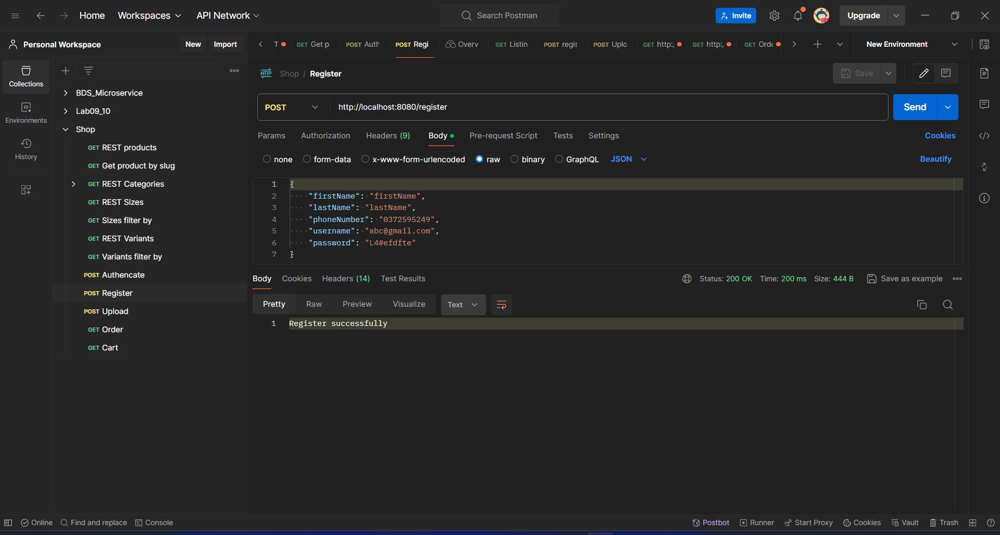
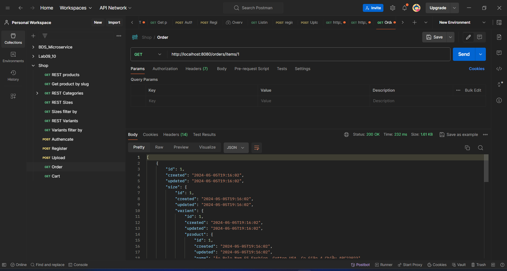
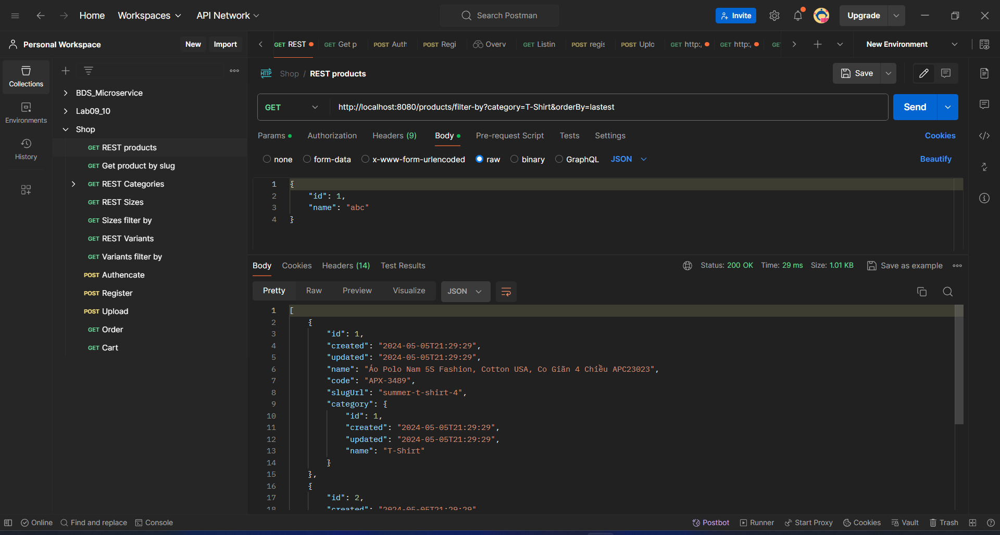

# About this repo
> This is backend part of the project
> I built with Spring Boot, Spring Data JPA, Spring Security, and MySQL
> The project is a simple e-commerce application
> This project contain some of unit tests is written with in Junit 5 and Mockito

> 

> And some api test using Postman
- login:
> 
- get product by slug:
> 
- register:
> 
> The frontend part is in: [limbanga/shop](https://github.com/limbanga/shop)
- get order details:
> 
- filter products by various criteria:
> 
- And all CRUD operations for products, categories, and orders.
> Give me a star if you liked this :))
## Project Structure
- `src` - contains all the source code
- `src/controllers` - contains all the controllers
- `src/models` - contains all the models
- `src/config` - contains all the configurations
- `src/exceptionghandlers` - contains all the exception handlers
- `src/helpers` - contains all the helper functions
- `src/services` - contains all the services
- `src/repositories` - contains all the repositories
- `src/requests` - contains all the request DTO classes
- `src/respones` - contains all the response DTO classes
- `src/seeds` - contains seed data class
- `src/resources/application.yml` - contains configurations of the app
- `test` - contains all the test files

## How to Run this project
> required: java >= 21.x

> Steps
1. Clone this repo
2. Open the project in your favorite IDE
3. Configure the `application.yml` file
4. Run `mvn clean install`
5. Run `mvn spring-boot:run`

default admin credentials
```
username: admin
password: admin
```
> Video guide how to run. [link]()


